<h1>多任务编程</h1>


# 1. 概述

学习要求 ：
> 什么是进程，进程和程序的区别  
> 了解进程的特征  
> 清楚进程的状态及状态间的转化关系  
> 并行和并发的区别，操作系统功能【操作系统完成】
> 编写一个程序，能够同时执行多个任务。同时需要在程序运行过程中，根据情况创建进程。

## 1.1. 实现意义与方式

意义： 
> 充分利用计算机的资源提高程序的运行效率

定义： 
> 通过应用程序利用计算机多个核心，达到同时执行多个任务的目的。

通常：  
> 单线程-单线程

实施方案： 
> 单进程 - 多线程  
> 多进程 - 单线程  
> 多进程 - 多线程

## 1.2. 基本概念

### 1.2.1. 并行和并发

并行： 
> 多个计算机核心在同时处理多个任务，多个任务之间是并行关系

并发： 
> 计算机同时处理多个任务，内核在多个任务间不断切换，达到好像在同时处理的运行效果。此时多个任务实际为并发关系  
> 【此处缺图，后台切换到前台等需求，单核处理？】

### 1.2.2. 进程和线程

#### 1.2.2.1. 进程

-   进程：  
> 程序在计算机中运行一次的过程 【进程是程序的一次运行实例】

- 程序和进程区别：

> 程序：是一个可执行文件，是静态的，占有磁盘，不占有计算机运行资源  
> 进程：是一个动态的过程描述，占有cpu内存等计算机资源的，有一定的生命周期  
> 同一个程序的不同执行过程是不同的进程，因为分配的计算机资源等均不同

#### 1.2.2.2. 线程

什么是线程？  
> 线程也是一种多任务编程的方式，可以使用计算机多核资源。线程又被称为轻量级的进程

线程特征  
> \* 一个进程可以包含多个线程  
> \* 线程是计算机核心分配的最小单位  
> \* 线程也是一个运行过程，也要消耗计算机资源。  
> \* 多个线程之间共享同一进程的资源和空间。  
> \* 线程也拥有自己特有的资源属性，比如指令集，TID等  
> \* 线程无论创建还是删除还是运行资源消耗都小于进程  
> \* 多个线程之间并行执行，互不干扰

### 1.2.3. cpu时间片：
> 如果一个进程占有计算机核心，我们称为该进程在cpu时间片上。多个任务实际对cpu会进行争夺，一般由操作系统分配cpu时间片

理解：

> cpu对于进程的处理是以时序的形式处理的，也就是时间片段内处理可执行的线程（进程中可执行的最小单元），操作系统并发执行是多个进程在一段时间内交错执行的。不考虑超线程的话，4核应该是只有4个线程在执行的，也就是4个进程。  
> ——廖雪峰笔记 \> Python3 \> 进程和多线程 \> 多进程 \> 评论区

### 1.2.4. PCB（进程控制块）：
> 在操作系统中，进程创建后会自动产生一个空间存放进程信息，称为进程控制块。

应用层：  
> 自己的理解：


# 2. 进程基本介绍
## 2.1. 进程的状态：三态和五态

> 三态  
> \* 就绪态：进程具备执行条件，等待系统分配cpu  
> \* 运行态：进程占有cpu处理器，处于运行状态  
> \* 等待态：进程暂时不具备运行条件，需要阻塞等待  
> 五态 （增加新建态和终止态）  
> \* 新建态：创建一个新的进程，获取资源的过程  
> \* 终止态：进程结束释放资源的过程

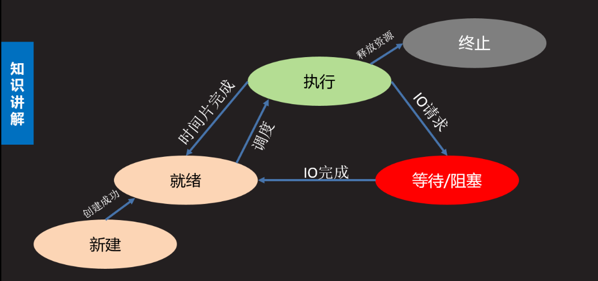

## 2.2. 进程信息查看（Linux）

进程信息包括进程PID ,进程占有的内存位置，创建时间，用户......

进程 PID :  
> 进程在操作系统中的唯一编号（大于0整数），由系统自动分配

### 2.2.1. 进程信息查看

查看进程树（process）：  
> 查看进程树： `pstree`  
> 查看父进程PID：`ps -ajx`

查看进程状态：  
> `ps -aux` ---\> STAT一列可查看进程状态  
> D 等待态 （不可中断等待）  
> S 等待态 （可中断等待）  
> T 等待态 （暂停状态）  
> R 运行态 （就绪态 运行态）  
> Z 僵尸态  
> \+ 前台进程  
> \< 高优先级  
> N 低优先级  
> l 有子进程的（有进程链接）  
> s 会话组组长(zuzhang)

### 2.2.2. 进程优先级查看

优先级决定了一个进程的执行权限和占有资源的优先程度

查看进程优先级  
> `top`：动态的查看进程优先级 `< >` 翻页【NI那一列代表优先级】  
> 取值范围：-20~19，-20优先级最高  
> `nice`：指定优先级运行程序  
> e.g.   
> `nice -9 ./while.py 9` 优先级  
> `sudo nice --9 ./while.py -9` 优先级（小于0需要加入sudo）

## 2.3. 进程特征

> \* 进程是操作系统分配计算机资源的最小单位  
> \* 每个进程都有自己单独的虚拟内存空间。
> \* 进程间的执行相互独立，互不影响  
> 
> 

具体是指虚拟内存地址，分配足够的地址保证程序正常运行

## 2.4. 进程的创建流程

> 1.【运行程序，发起请求】用户空间运行一个程序，发起进程创建  
> 2.【接受请求，创建进程】操作系统接受用户请求，开启进程创建  
> 3.【分配资源，确认运行】操作系统分配系统资源，确认进程状态  
> 4.【提供应用】将创建好的进程提供给应用层使用  
> 
> 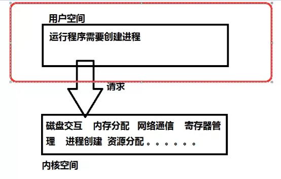

### 2.4.1. os.fork()创建子进程方法
仅在Linux中能够使用，Windows没有fork调用，上面的代码在Windows上无法运行。Mac系统是基于BSD（Unix的一种）内核，也能使用。

```python
import os  
pid = os.fork()  
功能：
    创建一个新的进程  
参数：
    无  
返回值：
    失败 返回一个负数 -1  
    成功 在原有进程中返回新的进程的 PID  
         在新的进程中返回 0
```

理解：  
> \* 子进程会复制父进程的全部数据，在内存中开辟新空间执行。【相当于复制打开了一份新文件执行】  
> \* 子进程从fork的下一句开始执行  
> \* 父子进程通常会根据fork返回值的差异选择执行不同的代码 （使用if结构）  
> \* 父子进程在执行上互不干扰，执行顺序不确定  
> \* 子进程虽然复制父进程内存空间，但是有自己的特性，比如PID号，PCB等  
> \* 父子进程空间独立，各自修改各自的内容，互不影响

- 实例：fork创建子进程

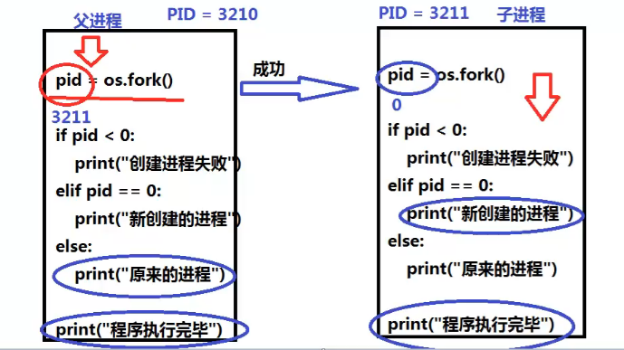

```python
import os
from time import sleep

a = 1
print("fork之前的部分只有父进程执行")

pid = os.fork()

if pid < 0:
    print("创建进程失败")
elif pid == 0:
    print("**************")  # 子进程执行fork之后的部分，此部分可自定义函数
    print("新创建的进程")
    sleep(1)
    print("a = ", a)
    a = 10000
else:
    sleep(2)
    print("==============")  # fork之前的部分只有父进程执行
    print("原来的进程")
    print("parent a = ", a)

print("程序执行完毕")
```
运行结果：
```
fork之前的部分只有父进程执行
**************
新创建的进程
a =  1
程序执行完毕
==============
原来的进程
parent a =  1
程序执行完毕
```
此实例可以看出父子进程之间数据独立不共享。

## 2.5. 父子进程

> 在系统中除了初始化进程每个进程都有一个父进程，可能有0个或者多个子进程。由此形成父子进程关系。我们认为每个进程都是父进程发起请求创建的。  
> 【比如计算机开机，上电，初始化程序，加载操作系统。。。】

### 2.5.1. 孤儿进程：
> 父进程先于子进程退出，此时子进程就会成为孤儿进程。  
> 孤儿进程会被系统指定的进程收养，即系统进程会成为该孤儿进程新的父进程。孤儿进程退出时该父进程会处理退出状态  
> 【换言之，孤儿进程退出不会成为僵尸进程】

示例：  
```python
import os,sys 
from time import sleep 

pid = os.fork()

if pid < 0:
    print("create process failed")
elif pid == 0:
    print("父进程pid:",os.getppid())
    sleep(2)
    print("父进程PID:",os.getppid())
else: 
    sleep(1)
    print("Parent PID:",os.getpid())
    sys.exit("父进程退出")
```

### 2.5.2. 僵尸进程：
> 子进程先于父进程退出，父进程没有处理子进程退出状态，此时子进程成为僵尸进程  
> 僵尸进程已经结束，但是会滞留部分PCB信息在内存，大量的僵尸会消耗系统资源，应该尽量避免。  
> 【避免方法见os模块 wait() 方法】

示例：产生僵尸进程  
```python
# fork_z.py
import os
import sys
from time import sleep

pid = os.fork()

if pid < 0:
    print("create process failed")
elif pid == 0:
    print("子进程ＰＩＤ:", os.getpid())
    sleep(3)
    sys.exit("子进程退出")
else:
    sleep(1)
    while True:
        sleep(1)
        pass

"""
$ python3 Untitled-1.py 

# 第一秒变化为：
子进程ＰＩＤ: 145

$ ps xf  # 另一个窗口
    9 tty1     Ss     0:00 /init
   10 tty1     S      0:00  \_ -bash
  144 tty1     S      0:00      \_ python3 Untitled-1.py
  145 tty1     S      0:00          \_ python3 Untitled-1.py


# 第三秒变化为：
子进程ＰＩＤ: 145
子进程退出

$ ps xf  # 另一个窗口
    9 tty1     Ss     0:00 /init
   10 tty1     S      0:00  \_ -bash
  144 tty1     S      0:00      \_ python3 Untitled-1.py
  145 tty1     Z      0:00          \_ [python3] <defunct>
"""
```

### 2.5.3. 僵尸进程的处理
- 如何处理僵尸进程？方法可以概括为两种：  
  1. 父进程处理子进程退出状态  
  2. 父进程先退出

#### 2.5.3.1. 方法1：父进程处理子进程退出状态，wait( )和waitpid( )捕获子进程推出状态

```C
pid, status = os.wait()
功能：
    在父进程中阻塞等待处理子进程的退出
    【默认为一个阻塞函数】
返回值：
    pid    退出的子进程的PID号
    status 子进程的退出状态

pid, status = os.waitpid(pid, option)
功能：
    同wait
参数：
    pid   -1 表示任意子进程退出
          >0 整数，指定PID号的子进程退出
    option 0 表示阻塞等待
           os.WNOHANG 表示非阻塞
返回值：
    同wait

waitpid(-1, 0) == wait()
```

实例1：os.wait( )阻塞避免僵尸进程

实例说明：  
> 让子进程 os._exit(2)  
> 主进程中执行 pid,status = os.wait()  
> os.WEXITSTATUS(status)  获取退出状态  
> pid, status = os.wait()  阻塞获取子进程信息：PID和status的状态 

文件：
```python
import os
from time import sleep

pid = os.fork()

if pid < 0:
    print("create process failed")
elif pid == 0:
    sleep(3)
    print("Child process over")
    os._exit(2)
else:
    # 等子进程执行完毕
    pid, status = os.wait()
    print("++++++++++++++++++++")
    print(pid, status, type(pid), type(status))
    print(os.WEXITSTATUS(status))  # 获取退出状态, 返回子进程的退出码
    while True:  # 保留进程运行，方便查看进程树
        pass
```

运行结果：  
```
Child process over
++++++++++++++++++++
45 512 <class 'int'> <class 'int'>
2
```

实例2：os.waitpid( )非阻塞方法避免僵尸进程

实例说明：  
> pid, status = os.waitpid(-1,os.WNOHANG)非阻塞获取子进程信息：PID和status的状态，因而需要sleep一秒等待子进程创建。  
> os.WEXITSTATUS(status)获取退出状态可以判断主程序中是否继续执行后续语句。

```python
import os
import sys
from time import sleep

pid = os.fork()

if pid < 0:
    print("create process failed")
elif pid == 0:
    sleep(3)
    print("子进程ＰＩＤ:", os.getpid())
    sys.exit(3)
else:
    # 等待子进程退出
    while True:
        sleep(1)
        pid, status = os.waitpid(-1, os.WNOHANG)
        print(pid, status)
        if os.WEXITSTATUS(status):
            break
        print("do something others")
    while True:
        pass
```

运行结果：  
```
0 0
do something others

0 0
do something others

子进程ＰＩＤ: 51
0 0
do something others

51 768
```

#### 2.5.3.2. 方法2：让父进程先退出——创建二级子进程

创建二级子进程  
> 1. 父进程创建子进程等待子进程退出  
> 2. 子进程创建二级子进程，然后马上退出  
> 3. 二级子进程成为孤儿，处理具体事件

实例：使用二级子进程退出父进程

实例说明：  
> 主进程中用wait()处理等待一级子进程，  
> 在一级子进程退出后，  
> 二级子进程（还在执行）变为孤儿进程，孤儿进程退出会被系统自动处理，因而可以完美解决僵尸进程

理解：

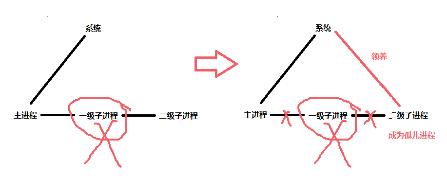

代码：
```python
# 创建二级子进程
import os
from time import sleep


def fun1():
    sleep(3)
    print("第一件事情")


def fun2():
    sleep(4)
    print("第二件事情")


pid = os.fork()

if pid < 0:
    print("Create process error")
elif pid == 0:
    # 创建二级进程
    pid0 = os.fork()
    if pid0 < 0:
        print("创建二级进程失败")
    elif pid0 == 0:
        fun2()  # 做第二件事
    else:
        os._exit(0)
else:
    pid, status = os.wait()
    print(pid, status)
    print('一级子进程退出状态：', os.WEXITSTATUS(status))  # 获取退出状态
    fun1()  # 做第一件事
```
运行代码：
```
164 0
一级子进程退出状态： 0
第一件事情
第二件事情
```

## 2.6. 进程os相关函数总结

-   导入模块：  
> import os  
> pid = os.fork()

-   获取PID：
> os.getpid()  
> 功能：获取当前进程的PID号  
> 返回值：返回PID号  
> 
> 示例：  
> print(os.getpid())  \#子进程中获取子进程PID，父进程中获取父进程PID

-   获取PPID：
> os.getppid()  
> 功能：获取父进程的进程号  
> 返回值：返回PID号
>
> 示例：  
> print("Parent PID",os.getppid()) \#子进程中获取父进程PID  
> print("Child PID",pid) \#父进程中获取子进程PID


-   退出程序：

    > os._exit(status)  
    > **功能：** 直接退出进程  
    > **参数：** 进程的退出状态 整数

    > sys.exit([status])  
    > **功能：** 会抛出一个异常: SystemExit，如果这个异常没有被捕获，那么python解释器将会退出。如果有捕获该异常的代码，那么这些代码还是会执行。  
    > **参数：** 默认为0 如果是整数则表示退出状态  
    > 如果是字符串则表示退出时打印内容  
    > \* sys.exit 可以通过捕获SystemExit异常阻止退出


# 3. 进程 (multiprocessing模块)
特点：跨平台，任意系统可用，相比之前os.fork()只能在Linux下运行，使用更为丰富。

multiprocessing 模块的用法：  
1）Process()创建进程类  
2）Pool()创建进程池  
3）进程间通信技术  
如：Pipe管道通信、Value和Array开辟共享内存通信、signal信号通信、  
## 3.1. Process( )创建进程类
流程：
> 1. 需要将要做的事件封装为函数  
> 2. 使用multiprocessing中提供的Process类创建进程对象  
> 3. 通过进程对象和Process 初始化函数对进程进行设置，并且绑定要执行的事件  
> 4. 启动进程，会自动执行相关联函数  
> 5. 事件完成后回收进程

### 3.1.1. Process()创建进程对象

```python
Process()
功能：创建进程对象
参数 ：
    name :  给创建的进程起一个名字
            默认Process-1
	target : 绑定的函数

	args：元组 给target函数按照位置传参
	kwargs：字典 给target函数按照键值出传参
 
p.start()
功能： 启动进程，此时进程被创建。自动运行进程函数

p.join([timeout])
功能：阻塞等待回收响应的进程
参数：超时时间
```

说明：  
> \* multiprocessing创建进程是原来进程的子进程，创建后父子进程各自执行互不影响  
> \* 子进程同样是复制父进程的空间，子进程对内容的修改不会影响父进程空间  
> \* join回收子进程，会有效的阻止僵尸进程产生

创建子进程时，只需要创建一个Process实例，传入一个执行函数和函数的参数，用start()方法启动，这样创建进程比fork()还要简单。

join()方法可以等待子进程结束后再继续往下运行，通常用于进程间的同步。

通常使用multiprocessing创建进程，父进程只用作进程的创建和回收，不做其他工作。

### 3.1.2. 属性：multiprocessing 进程对象属性
multiprocessing 进程对象属性

`p.start()` 启动进程  
`p.join()`回收进程  

`p.is_alive()`  判断进程生命周期状态，返回True/False  
`p.name`  进程名称，默认为Process-1，如果起名字则为自定义名称  
`p.pid`  创建的进程的PID  

`p.daemon`  控制子进程的退出是否被受父进程生命周期影响
- 默认值为False   父进程退出不会影响子进程运行  
- 如果设置为True  则父进程退出子进程也会退出  
*daemon 的设置必须在 start 前*  
*如果设置 daemon 为 True 则不再使用 join*

### 3.1.3. 创建自己的进程类
> 1. 继承Process类  
> 2. 重写__init__ 并且调用父类的__init__  
> 3. 重写run方法，此时生成对象后 调用start就会自动运行run  

### 3.1.4. 实例

#### 3.1.4.1. 实例1：Process( )创建子进程

实例：
```python
# -*- coding: utf-8 -*-
import multiprocessing as mp
from time import sleep
import os

a = 1
print("[父/子] PID", os.getpid(), a, "===================")


def fun(xx):  # 进程事件
    sleep(1)
    global a
    print("[子]", "-----------------", a)
    print("[子]", "子进程事件")
    print("[子]", "传入内容：", xx)
    print("[子]", 'PID', os.getpid())
    a = 10000
    print("[子]", "-----------------", a)


# windows下运行需要此句判断，否则报错，Linux下无需
if __name__ == "__main__":
    print("[父]", 'PPID', os.getpid())
    p = mp.Process(target=fun, args=('test',))  # 创建进程对象

    p.start()  # 启动进程
    print("[父]", "这是父进程")
    p.join()  # 回收进程

    print("[父]", "===================", a)
```
windows运行结果：
```
[父/子] PID 9272 1 ===================
[父] PPID 9272
[父] 这是父进程
[父/子] PID 22788 1 ===================
[子] ----------------- 1
[子] 子进程事件
[子] 传入内容： test
[子] PID 22788
[子] ----------------- 10000
[父] =================== 1
```
Linux运行结果：
```
[父/子] PID 36 1 ===================
[父] PPID 36
[父] 这是父进程
[子] ----------------- 1
[子] 子进程事件
[子] 传入内容： test
[子] PID 37
[子] ----------------- 10000
[父] =================== 1
```
【备注：Windows是全代码重头运行，Linux则是按照规矩仅从函数运行】

#### 3.1.4.2. 实例2：Process( )创建多个子进程

文件：
```python
from multiprocessing import Process 
from time import sleep 
import os 

def th1():
    sleep(3)
    print("吃饭")
    print(os.getppid(),"----",os.getpid())

def th2():
    sleep(2)
    print("睡觉")
    print(os.getppid(),"----",os.getpid())

def th3():
    sleep(4)
    print("打豆豆")
    print(os.getppid(),"----",os.getpid())

if __name__ == '__main__':
    things = [th1,th2,th3]
    process = []

    for th in things:
        p = Process(target = th)
        process.append(p) #保存进程对象
        p.start()

    for p in process:
        p.join()
```

运行结果：  
```
睡觉
14240 ---- 19864
吃饭
14240 ---- 23340
打豆豆
14240 ---- 15868
```

#### 3.1.4.3. 实例3：Process()创建的子进程属性获取

实例说明：  
> \#判断进程状态  
> print("is alive :", p.is_alive())  
> \#进程名  
> print("process name:", p.name)  
> \#子进程ＰＩＤ  
> print("process PID:", p.pid)

文件：
```python
from multiprocessing import Process
from time import sleep


def worker(sec, name):
    sleep(sec)
    print("I'm %s" % name)
    print("I'm working.....")


if __name__ == '__main__':
    # 通过args给函数传参
    # 通过kwargs给函数传参
    p = Process(name="Worker", target=worker, args=(2,),
                kwargs={'name': 'Levi'})
    p.start()
    # 判断进程状态
    print("is alive :", p.is_alive())
    # 进程名
    print("process name:", p.name)
    # 子进程ＰＩＤ
    print("process PID:", p.pid)
    p.join()  # join之前不阻塞
    print("=====Process over========")
```

运行结果：  
```
is alive : True
process name: Worker
process PID: 41
I'm Levi
I'm working.....
=====Process over========
```

#### 3.1.4.4. 实例4：设置p.daemon主程序退出控制子程序运行

文件：
```python
from multiprocessing import Process
from time import sleep, ctime


def tm():
    while True:
        sleep(2)
        print(ctime())


if __name__ == '__main__':
    p = Process(target=tm)

    # 在start前设置daemon为ｔｒｕｅ
    p.daemon = True

    p.start()
    sleep(5)
    print("main process over")
```

运行结果：
```
Wed Jan  8 14:18:45 2020
Wed Jan  8 14:18:47 2020
main process over
```


#### 3.1.4.5. 实例5：自定义进程类对象

```python
from multiprocessing import Process
import time


class ClockProcess(Process):
    def __init__(self, value):
        #调用父类的__init__
        super().__init__()
        self.value = value

    #重写run方法
    def run(self):
        for i in range(5):
            time.sleep(self.value)
            print("The time is {}".format(time.ctime()))


if __name__ == "__main__":
    #用自己的类创建进程对象
    p = ClockProcess(2)

    p.start()  # 本身会自动调用run方法
    p.join()
```
运行结果：
```
The time is Wed Jan  8 14:41:40 2020
The time is Wed Jan  8 14:41:42 2020
The time is Wed Jan  8 14:41:44 2020
The time is Wed Jan  8 14:41:46 2020
The time is Wed Jan  8 14:41:48 2020
```

## 3.2. Pool()进程池

总结：  
> Pool() 创建进程池  
> apply_async() 添加事件  
> close() 关闭进程池  
> join（）回收  
> map()

注意事项：  
> Python中创建的子进程运行的报错信息是无法看见的，慎用。可用异常处理，参考  
> ——python3中子进程不报错的问题 - wmyycsdn的博客 - CSDN博客  
> <https://blog.csdn.net/wmyycsdn/article/details/77744711>

### 3.2.1. 背景

- 传统创建多进程优劣分析
```
优点： 
    能并行执行多个任务，提高效率
    创建方便，运行独立，不受其他进程影响
    数据安全
缺点：
    进程的创建和删除都需要消耗计算机的资源
```

**进程池产生原因：** 如果有大量任务需要多进程完成，且可能需要频繁的创建和删除进程，给计算机带来大量的资源消耗。

**原理：** 在进程池内运行一定数量进程，通过这些进程完成进程池队列中的事件，直到事件执行完毕，减少进程不断的创建删除过程。


### 3.2.2. 进程池流程：
> 1. 创建进程池，在进程池中放入适当进程  
> 2. 将事件加入到进程池队列  
> 3. 事件不断运行，直到所有事件运行完毕  
> 4. 关闭进程池，回收进程

【进程数量限制】在进程池内运行一定数量进程，  
【如何限制？进程池队列】通过这些进程完成进程池队列中的事件，  
直到事件执行完毕，减少进程不断的创建删除过程。

```
from multiprocessing import Pool

pool = Pool(processes)
功能：创建进程池对象
参数：表示进程池中有多少进程

pool.apply_async(func, args, kwds)
功能：将事件放入进程池队列
参数：func  要执行的事件
      args  给func用元组传参
      kwds  给func用字典传参
返回值：返回事件对象。
        通过get()方法获取事件函数返回值，
          一般放于join后执行，可用列表暂存事件对象

pool.apply(func, args, kwds)
功能：将事件放入进程池队列
参数：func  要执行的事件
      args  给func用元组传参
      kwds  给func用字典传参

pool.close()
功能：关闭进程池，不能再添加新的事件

pool.join()
功能：阻塞等待回收进程池


pool.map(func,iter)
功能：将要完成的事件放入进程池
参数：func 要完成的事件函数
      iter 可迭代对象给func传参 
返回值：事件函数的返回值列表
```

### 3.2.3. 实例1：pool创建运行多进程

```python
from multiprocessing import Pool
import os
import time

def worker(name):
    time.sleep(1)  # random.random() * 2)
    print('hello', name)

if __name__ == '__main__':
    print('Parent process %s.' % os.getpid())
    p = Pool(4)
    for i in range(10):
        p.apply_async(worker, args=(i,))
    print('Waiting for all subprocesses done...')
    p.close()
    p.join()
```

运行结果：
```
Parent process 17672.
Waiting for all subprocesses done...

hello 0
hello 1
hello 2
hello 3

hello 4
hello 5
hello 6
hello 7

hello 8
hello 9
```
运行说明：  
hello0-3在第1秒一起出现  
hello4-7在第2秒一起出现  
hello8-9在第3秒一起出现  

### 3.2.4. 实例2：pool创建运行多进程（嵌套函数）

```python
from multiprocessing import Pool
from time import sleep, time
import os


def zi(x):
    print('--->', os.getppid(), os.getpid(), '这是子子进程', x)

def worker(i):
    sleep(i+1)
    print("worker():", os.getppid(), os.getpid())
    for i in range(3):
        zi(("i:", i))

if __name__ == '__main__':
    t0 = time()
    pool = Pool(processes=4)
    Lresult = []
    for i in range(3):
        r = pool.apply_async(func=worker, args=(i,))
    pool.close()
    pool.join()
    print('运行了%s秒' % (time() - t0))

"""
worker(): 228 229
---> 228 229 这是子子进程 ('i:', 0)
---> 228 229 这是子子进程 ('i:', 1)
---> 228 229 这是子子进程 ('i:', 2)
worker(): 228 230
---> 228 230 这是子子进程 ('i:', 0)
---> 228 230 这是子子进程 ('i:', 1)
---> 228 230 这是子子进程 ('i:', 2)
worker(): 228 231
---> 228 231 这是子子进程 ('i:', 0)
---> 228 231 这是子子进程 ('i:', 1)
---> 228 231 这是子子进程 ('i:', 2)
运行了3.280599355697632秒
"""
```

### 3.2.5. 实例2：pool.get()的使用

文件：
```python
from multiprocessing import Pool
from time import sleep, ctime, time


def worker(msg):
    sleep(1)
    print(msg)
    return msg + " over"

if __name__ == '__main__':
    t0 = time()

    pool = Pool(processes=2)
    Lresult = []
    for i in range(3):
        for j in range(2):
            msg = "hello %d-%d" % (i, j)
            r = pool.apply_async(func=worker, args=(msg,))
            Lresult.append(r)
    pool.close()
    pool.join()
    for i in Lresult:
        print(i.get())

    print('运行了%s秒' % (time() - t0))
```

运行结果：  
```
hello 0-0
hello 1-0
hello 2-0
hello 0-1
hello 1-1
hello 2-1
hello 0-0 over
hello 0-1 over
hello 1-0 over
hello 1-1 over
hello 2-0 over
hello 2-1 over
运行了3.333099842071533秒
```

### 3.2.6. 实例3：pool.map()进程池，返回列表

实例说明：  

文件：
```python
from multiprocessing import Pool
import time

def fun(n):
    time.sleep(1)
    print("执行 pool map事件", n, n * n)
    return n * n

if __name__ == '__main__':
    # 创建进程池
    pool = Pool(4)
    # 使用map将事件放入进程池
    r = pool.map(fun, range(6))

    print("返回值列表r", r, type(r))
    pool.close()
    pool.join()
```

运行结果：  
```
执行 pool map事件 1 1
执行 pool map事件 2 4
执行 pool map事件 0 0
执行 pool map事件 3 9
执行 pool map事件 4 16
执行 pool map事件 5 25
返回值列表r [0, 1, 4, 9, 16, 25] <class 'list'>
```

## 3.3. 进程通信

-   起源：  
> 进程间由于空间独立，资源无法互相直接获取，此时在不同的进程间进行数据传递就需要专门的通信方法

-   进程间通信方法（IPC）

管道 消息队列 共享内存 信号 信号量 套接字
-	总结：
Pipe、Queue、Value、Array、...  
（进程间通信）
```
  管道：      fd1,fd2 = Pipe()   recv()     send()
  消息队列:   q = Queue()       q.get()     q.put()    q.full() 
              q.empty()        q.qsize()   q.close()
  共享内存：  Value()    obj.value
              Array()    shm[]
  信号（并非真正意义上的通信，只能传递信号）
  套接字
```

-   对比

|    -     |      管道Pipe      | 消息队列Queue |          共享内存          |
| -------- | ------------------ | ------------- | -------------------------- |
| 开辟空间 | 内存               | 内存          | 内存                       |
| 读写方式 | 两端读写 双向/单向 | 先进先出      | 操作覆盖内存               |
| 效率     | 一般               | 一般          | 较快                       |
| 应用     | 多用于两端         | 使用广泛      | 复杂，需要通信同步互斥机制 |

Pipe的读写效率要高于Queue。

### 3.3.1. Pipe管道通信

管道： 
> 在内存中开辟一段空间，形成管道结构，管道对多个进程可见，进程可以对管道进行读写操作

multiprocess ---> Pipe  
```python
fd1,fd2 = Pipe(duplex = True)
功能 ： 创建一个管道
参数 ： 默认为双向管道
        如果设置为False 则为单向管道
返回值 ：如果双向管道，fd1 fd2都可以进行读写操作
         如果是单向管道，则fd1 只可读，fd2只可写

fd.recv()
功能 ： 从管道读取内容
返回值 ： 读到的内容

* 如果管道无内容则阻塞

fd.send(data)
功能： 向管道写入内容
参数： 要发送的内容
* 几乎可以发送所有python支持的数据
```
【我的理解，管道相当于一个缓冲区】

Pipe的读写效率要高于Queue。

python 学习笔记 - Queue & Pipes，进程间通讯 - helloword - SegmentFault 思否

<https://segmentfault.com/a/1190000008122273>

原理示意图如下：

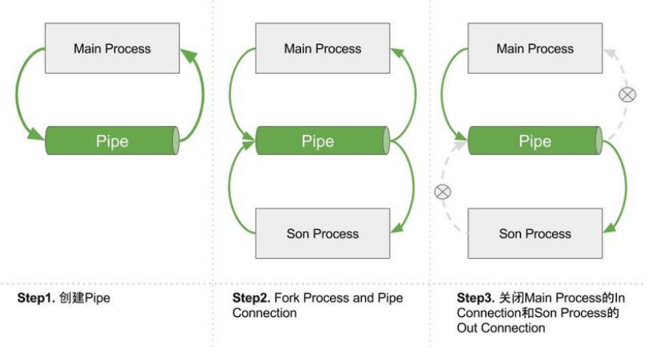

#### 3.3.1.1. 实例1：Pipe()

文件：
```python
from multiprocessing import Process, Pipe
import time


def send_msg(i, fd2):
    time.sleep(3)
    # 向管道写入内容
    fd2.send({'a': i, 'b': i})


if __name__ == "__main__":
    # **1）定义管道**(创建管道)
    fd1, fd2 = Pipe(False)
    jobs = []
    # **2）发送内容（子进程）**
    for i in range(5):
        p = Process(target=send_msg, args=(i, fd2))
        jobs.append(p)
        p.start()
    # **3）读取管道（主进程）**
    for i in range(5):
        data = fd1.recv()  # 若管道无内容则阻塞
        print(data)
    for i in jobs:
        i.join()
```

运行结果：  
```
{'a': 0, 'b': 0}
{'a': 1, 'b': 1}
{'a': 2, 'b': 2}
{'a': 3, 'b': 3}
{'a': 4, 'b': 4}
```
### 3.3.2. Queue消息队列

队列：先进先出  
> 在内存中开辟队列结构空间，多个进程可以向队列投放消息，在取出的时候按照存入顺序取出

```
导入模块
from multiprocessing import Queue

创建队列
q = Queue(maxsize = 0)
功能 ： 创建队列
参数 ： maxsize  默认表示根据系统分配空间存储消息，可以认为可行条件下是无限制的
        如果传入一个正整数则表示最多存放多少条消息
返回 ： 队列对象

q.put(data,[block,timeout])
功能： 存放消息
参数： data  存入的消息 （python数据类型）
       block  默认为True表示当队列满的时候阻塞
              设置为False则表示非阻塞
       timeout   当block为True表示超时时间

data = q.get([block,timeout])
功能 ： 取出消息
参数 ： block 默认为True 当队列空时阻塞
              设置为False表示非阻塞
        timeout 当block为True时表示超时时间
返回值 ： 返回获取的消息

q.full()   判断队列是否为满
q.empty()  判断队列是否为空
q.qsize()  判断当前队列有多少消息
q.close()  关闭队列
```

#### 3.3.2.1. 实例1：Queue()基本使用

文件：
```python
from multiprocessing import Queue
from time import sleep

# 创建消息队列
q = Queue(3)

q.put(111)
sleep(0.1)
print(q.empty())  # False，是否为空
print(q.full())   # False，是否为满
q.put(222)
q.put(333)
print(q.qsize())  # 3，判断当前队列有多少消息
print(q.full())   # True
# 队列已满则阻塞
# q.put(4,True,3)
print(q.get())    # 111, 取出消息
print(q.qsize())  # 2，判断当前队列有多少消息
q.close()
```

运行结果：  
```
False
False
3
True
111
2
```

#### 3.3.2.2. 实例2：Queue()在多进程中的应用

文件：
```python
from multiprocessing import Process, Queue
import time


def fun1(q):
    time.sleep(1)
    q.put([1, 2, 3, 4])


def fun2(q):
    print("收到消息:", q.get())


if __name__ == "__main__":
    # 创建消息队列
    q = Queue()

    p1 = Process(target=fun1, args=(q,))
    p2 = Process(target=fun2, args=(q,))

    p1.start()
    p2.start()

    p1.join()
    p2.join()
```

运行结果：  
```
收到消息: [1, 2, 3, 4]
```

### 3.3.3. Value、Array共享内存

**基本特点：**  
> （1）共享内存是一种最为高效的进程间通信方式，进程可以直接读写内存，而不需要任何数据的拷贝。  
> （2）为了在多个进程间交换信息，内核专门留出了一块内存区，可以由需要访问的进程将其映射到自己的私有地址空间。进程就可以直接读写这一块内存而不需要进行数据的拷贝，从而大大提高效率。（文件映射）  
> （3）由于多个进程共享一段内存，因此也需要依靠某种同步机制。

**优缺点：**  
> 优点： 快速在进程间传递数据  
> 缺点： 数据安全上存在风险，内存中的内容会被其他进程覆盖或者篡改


**共享内存使用方法**

>在内存中开辟一段空间，存储数据，对多个进程可见。每次写入共享内存中的数据会覆盖之前的内容

>共享内存要符合C语言的使用语法  
>Value：将一个值存放在内存中，  
>Array：将多个数据存放在内存中，但要求数据类型一致  
>**注：** 经常和同步互斥配合使用

#### 3.3.3.1. 语法：
```python
from multiprocessing import Value

obj = Value(ctype,obj)
功能 ： 开辟共享内存空间
参数 ： ctype   字符串  要转变的c的数据类型
                        对比类型对照表
	obj   共享内存的初始化数据
返回 ： 共享内存对象

obj.value  表示共享内存中的值。对其修改或者使用即可

from multiprocessing import Array

obj = Array(ctype,obj)
功能： 开辟共享内存
参数： ctype  要转化的c的类型
       obj    要存入共享内存的数据
        列表    将列表存入共享内存，数据类型一致
	    正整数  表示开辟几个数据空间
```

补充：数据类型ctype

| Type code | C Type             | Python Type       | Minimum size in bytes | Notes |
|-----------|--------------------|-------------------|-----------------------|-------|
| 'c'       |                    |                   |                       |       |
| 'b'       | signed char        | int               | 1                     |       |
| 'B'       | unsigned char      | int               | 1                     |       |
| 'u'       | Py_UNICODE         | Unicode character | 2                     | (1)   |
| 'h'       | signed short       | int               | 2                     |       |
| 'H'       | unsigned short     | int               | 2                     |       |
| 'i'       | signed int         | int               | 2                     |       |
| 'I'       | unsigned int       | int               | 2                     |       |
| 'l'       | signed long        | int               | 4                     |       |
| 'L'       | unsigned long      | int               | 4                     |       |
| 'q'       | signed long long   | int               | 8                     | (2)   |
| 'Q'       | unsigned long long | int               | 8                     | (2)   |
| 'f'       | Float              | float             | 4                     |       |
| 'd'       | Double             | float             | 8                     |       |  
> 其他笔记  
> Array(‘i’, range(10))中的‘i’参数：  
> ‘c’: ctypes.c_char  
> ‘u’: ctypes.c_wchar  
> ‘b’: ctypes.c_byte  
> ‘B’: ctypes.c_ubyte  
> ‘h’: ctypes.c_short  
> ‘H’: ctypes.c_ushort  
> ‘i’: ctypes.c_int  
> ‘I’: ctypes.c_uint  
> ‘l’: ctypes.c_long,  
> ‘L’: ctypes.c_ulong  
> ‘f’: ctypes.c_float  
> ‘d’: ctypes.c_double


#### 3.3.3.2. 实例1：Value( )共享内存

文件：
```python
from multiprocessing import Process, Value
import time
import random


def deposite(money):
    """存钱"""
    for i in range(50):
        time.sleep(0.05)
        # 对money value属性进行操作
        money.value += random.randint(1, 200)
    print('存钱函数执行完毕')


def withdraw(money):
    """取钱"""
    for i in range(50):
        time.sleep(0.04)
        money.value -= random.randint(1, 200)
    print('取钱函数执行完毕')


if __name__ == '__main__':
    # 创建共享内存对象
    # 存放整形，初始为２０００
    money = Value('i', 2000)  # 表示将int类型的值2000绑定给变量money

    d = Process(target=deposite, args=(money,))
    w = Process(target=withdraw, args=(money,))

    print('开始对象.start')
    d.start()
    w.start()

    d.join()
    w.join()

    # 查看共享内存数据
    print(money.value)
```

运行结果：  
```
开始对象.start
取钱函数执行完毕
存钱函数执行完毕
1737
```

#### 3.3.3.3. 实例2：Array()共享内存基本使用

```python
from multiprocessing import Process, Array
import time

# 支持bytes格式字符串
shm = Array('c', b'hello')
print(shm)  # 返回内存地址
for i in shm:
    print(i)

shm[0] = b'H'

# 得到整个共享内存中的数据
print(shm.value)
```
结果：
```
<SynchronizedString wrapper for <multiprocessing.sharedctypes.c_char_Array_5 object at 0x000001F0FA2A1CC8>>
b'h'
b'e'
b'l'
b'l'
b'o'
b'Hello'
```

#### 3.3.3.4. 实例3：Array()共享内存在多进程中的使用

文件：
```python
from multiprocessing import Process, Array
import time


def fun(shm):
    # shm 是可迭代对象
    for i in shm:
        print(i)
    # 修改共享内存
    print(list(shm))
    shm[3] = 1000


if __name__ == '__main__':
    # 创建共享内存，存入列表　
    shm = Array('i', [1, 2, 3, 4, 5])
    # shm = Array('i', b"abcde")
    # shm = Array('i', range(5))
    # shm = Array('i', 5)  # 表示开辟５个空间
    p = Process(target=fun, args=(shm,))
    p.start()
    p.join()

    print("=================")
    for i in shm:
        print(i)
```

运行结果：  
```
1
2
3
4
5
[1, 2, 3, 4, 5]
=================
1
2
3
1000
5
```

## 3.4. 信号（signal模块）
> 一个进程向另一个进程通过信号传递某种讯息，接收方在接收到信号后进行相应的处理

发送信号：`kill -signum PID` 给PID的进程发送一个信号，按接受信息执行相关事务（并非一定是杀死进程）
查看信号：`kill -l` 打印信号列表（前31个为常用信号）  
```shell
$ kill -l
 1) SIGHUP       2) SIGINT       3) SIGQUIT      4) SIGILL       5) SIGTRAP
 6) SIGABRT      7) SIGBUS       8) SIGFPE       9) SIGKILL     10) SIGUSR1
11) SIGSEGV     12) SIGUSR2     13) SIGPIPE     14) SIGALRM     15) SIGTERM
16) SIGSTKFLT   17) SIGCHLD     18) SIGCONT     19) SIGSTOP     20) SIGTSTP
21) SIGTTIN     22) SIGTTOU     23) SIGURG      24) SIGXCPU     25) SIGXFSZ
26) SIGVTALRM   27) SIGPROF     28) SIGWINCH    29) SIGIO       30) SIGPWR
31) SIGSYS      34) SIGRTMIN    35) SIGRTMIN+1  36) SIGRTMIN+2  37) SIGRTMIN+3
38) SIGRTMIN+4  39) SIGRTMIN+5  40) SIGRTMIN+6  41) SIGRTMIN+7  42) SIGRTMIN+8
43) SIGRTMIN+9  44) SIGRTMIN+10 45) SIGRTMIN+11 46) SIGRTMIN+12 47) SIGRTMIN+13
48) SIGRTMIN+14 49) SIGRTMIN+15 50) SIGRTMAX-14 51) SIGRTMAX-13 52) SIGRTMAX-12
53) SIGRTMAX-11 54) SIGRTMAX-10 55) SIGRTMAX-9  56) SIGRTMAX-8  57) SIGRTMAX-7
58) SIGRTMAX-6  59) SIGRTMAX-5  60) SIGRTMAX-4  61) SIGRTMAX-3  62) SIGRTMAX-2
63) SIGRTMAX-1  64) SIGRTMAX
```
关于信号（见下面两个表）
信号名称：信号的名字或者数字  
信号含义：信号的作用  
默认行为：当一个进程接收到信号时采取的行为，如终止进程，暂停进程，忽略产生

e.g.  
```
 1) SIGHUP   终端断开
 2) SIGINT   ctrl + c
 3) SIGQUIT  ctrl + \
20) SIGTSTP  ctrl + z 
 9) SIGKILL  终止进程且不能被处理
19) SIGSTOP  暂停进程且不能被处理
14) SIGALRM  时钟信号
17) SIGCHLD  子进程状态改变发给父进程
```

信号表：  
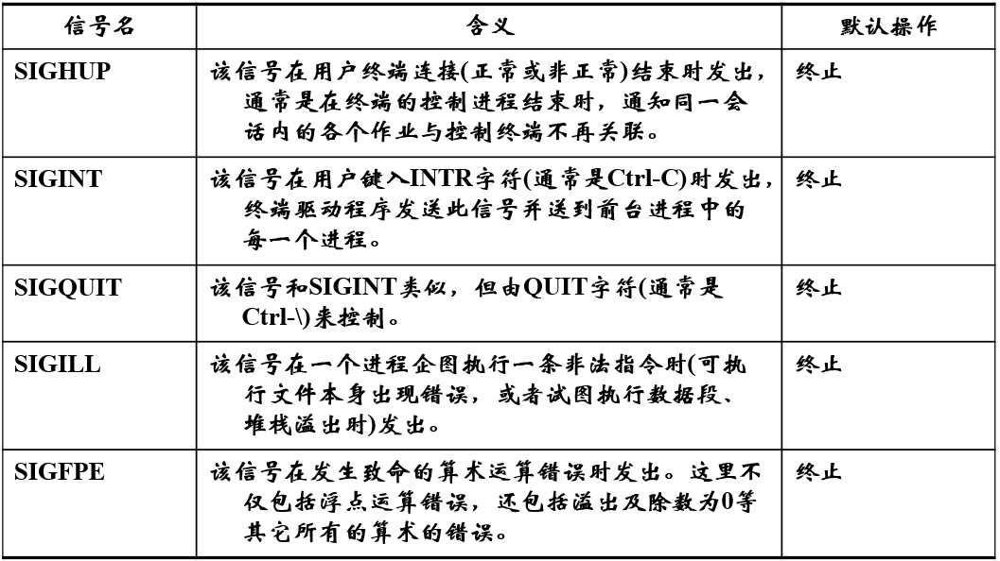
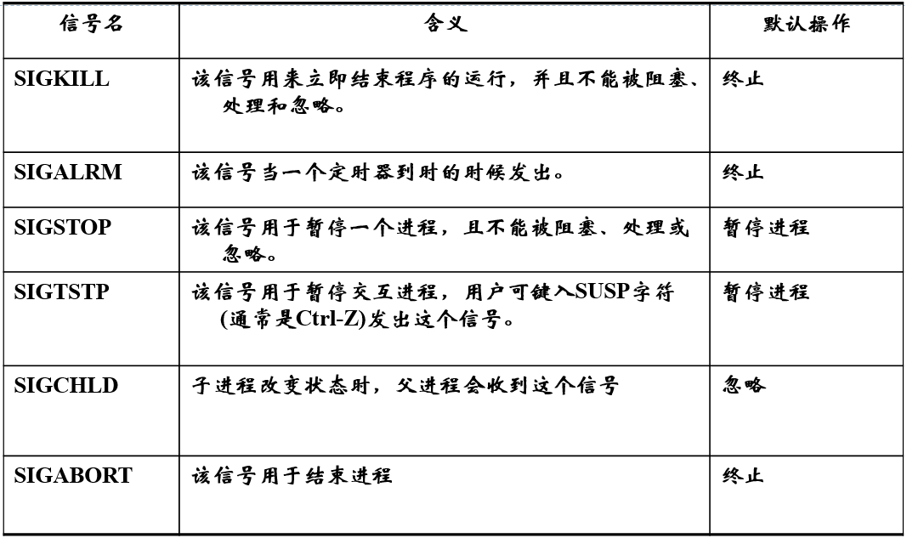

### 3.4.1. 通过os.kill和signal进行信号处理

```shell
import os, signal

os.kill(pid, sig)
功能 ： 发送信号给某个进程
参数 ： pid    给哪个进程发送信号
        sig    要发送什么信号 `dir(signal)`可以查看信号列表

signal.alarm(sec)
功能 ： 一定时间后给自身发送一个 SIGALRM信号
参数 ： 指定时间

* 一个进程中只能设置一个时钟，第二个时钟会覆盖之前的时间
```

#### 3.4.1.1. 实例1：os.kill发送signal信号

文件1：`do.py`
```python
# do.py
import os
from time import sleep, ctime

while True:
    sleep(3)
    print(ctime(), os.getpid())
```

文件2：`kill.py`
```python
import os, signal
os.kill(408, signal.SIGKILL)  # 找到对应PID号
```

运行：
```bash
$ python3 do.py  # 终端1
Thu Jan  9 00:31:18 2020 PID： 408
Thu Jan  9 00:31:21 2020 PID： 408
Thu Jan  9 00:31:24 2020 PID： 408
...
$ python3 kill.py  # 终端2，新建窗口，运行
$ python3 do.py  # 终端1变化
Thu Jan  9 00:31:18 2020 PID： 408
Thu Jan  9 00:31:21 2020 PID： 408
Thu Jan  9 00:31:24 2020 PID： 408
...
已杀死
```

#### 3.4.1.2. 实例2：alarm发送信号

实例说明：
<font color="red"><b>
与之前所有学过的代码执行方式不一样的地方在于：第三行的代码执行完了，并且正常往后执行，但后续还会受到它的影响，这种模式被称为异步执行。
</b></font>

文件：
```python
# encoding=utf8
import signal
import time

signal.alarm(3)  # 非阻塞
time.sleep(2)

# 进程中只能有一个时钟，如果第一个还未发生，第二个将会覆盖第一个
signal.alarm(5)

# 等待信号，此句运行，那么直接等待闹钟并退出
# signal.pause()


while True:
    time.sleep(1)
    print("等待时钟信号......")

"""
等待时钟信号......
等待时钟信号......
等待时钟信号......
等待时钟信号......
闹钟
"""
```

### 3.4.2. 程序执行的同步和异步：

同步：按照步骤一步一步顺序执行（按照顺序逐句执行，一步完成再做下一步）  
异步：在程序执行中利用内核，不影响应用层程序持续执行  


异步执行的原理：  
信号交由内核处理。  
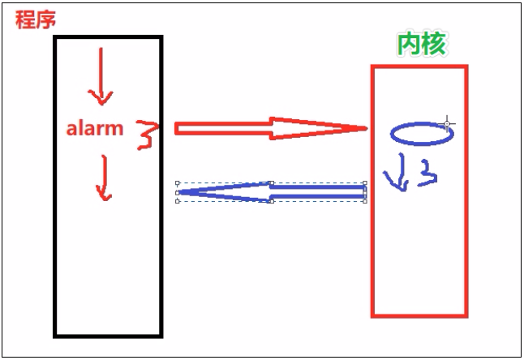

\* 信号是唯一的异步通信方式  

```shell
signal.pause()
功能： 阻塞等待一个信号的发生

signal.signal(signum, handler)
功能 ： 处理信号
参数 ： signum  ： 要处理的信号
        handler ： 信号的处理方法
            SIG_DFL  表示使用默认的方法处理
            SIG_IGN  表示忽略这个信号
            func     自定义函数处理信号
                def func(sig,frame):
                    pass 
                sig ： 表示要处理的信号（捕获到的信号, 从signum传参传入）
                frame ： 信号的结构对象（信号对象）
* signal函数是一个异步处理函数
* signal函数不能处理 SIGKILL SIGSTOP信号
* 在父进程中使用signal(SIGCHLD, SIG_IGN),这样子进程退出时会有系统自动处理
```

#### 3.4.2.1. 实例1：改变信号默认处理行为

```python
import signal 
from time import sleep 

signal.alarm(5)

# 使用默认方法处理SIGALRM信号
# signal.signal(signal.SIGALRM,signal.SIG_DFL)

# （改变默认行为）
# 使用忽略的方式处理信号，让SIGALRM信号失效，什么也没发生
signal.signal(signal.SIGALRM, signal.SIG_IGN)
# 忽略ctrl+c，使ctrl+c信号失效
signal.signal(signal.SIGINT, signal.SIG_IGN)

while True:
    sleep(2)
    print("让你恩ctrl+c")
    print("等待时钟．．．．．")
```

#### 3.4.2.2. 实例2：使用自定义函数处理改变信号行为

```python
# encoding=utf8
import signal
import time 

#信号处理函数
def handler(sig,frame):
    if sig == signal.SIGALRM:
        print("收到时钟信号")
    elif sig == signal.SIGINT:
        print("就不退出")

signal.alarm(5)

#信号使用handler函数处理
signal.signal(signal.SIGALRM, handler)
signal.signal(signal.SIGINT, handler)

while True:
    time.sleep(2)
    print("Waiting for a signal")
```

#### 3.4.2.3. 练习：利用信号，自定义信号行为

```
作业 ：1. 复习网路编程 （tcp  udp  http）
       2. 司机和售票员的故事
         * 创建父子进程，分别表示司机售票员
         * 当售票员捕捉到SIGINT信号，发送给司机
           SIGUSER1信号，此时司机打印“老司机开车了”
	       当售票员捕捉到SIGQUIT信号，发送给司机
           SIGUSER2信号，此时司机打印“车速有点快，系好安全带”
           当司机捕捉到SIGTSTP信号，给售票员发送
           SIGUSER1,此时售票员打印“到站了请下车”
	* 到站后，售票员先下车（子进程先退出）,然后司机下车
```

```python
import multiprocessing as mp
from signal import *
import os
from time import sleep

#saler信号处理函数
def saler_handler(sig,frame):
    if sig == SIGINT:
        os.kill(os.getppid(),SIGUSR1)
    elif sig == SIGQUIT:
        os.kill(os.getppid(),SIGUSR2)
    elif sig == SIGUSR1:
        print("到站了，请下车")
        os._exit(0)

#driver信号处理函数
def driver_handler(sig,frame):
    if sig == SIGUSR1:
        print("老司机开车了")
    elif sig == SIGUSR2:
        print("车速有点快，系好安全带")
    elif sig == SIGTSTP:
        os.kill(p.pid,SIGUSR1)

#售票员
def saler():
    signal(SIGINT,saler_handler) 
    signal(SIGQUIT,saler_handler)
    signal(SIGUSR1,saler_handler)
    signal(SIGTSTP,SIG_IGN)
    while True:
        sleep(1)
        print("Python　带你去远方")

p = mp.Process(target = saler)
p.start()

#司机
signal(SIGUSR1,driver_handler)
signal(SIGUSR2,driver_handler)
signal(SIGTSTP,driver_handler)
signal(SIGINT,SIG_IGN)
signal(SIGQUIT,SIG_IGN)

p.join()
```

按ctrl+c/z/\可以看到不同效果

## 3.5. 信号量Semaphore

给定一定的数量，对多个进程可见，并且多个进程根据信号量的多少确定不同的行为

multiprocessing ---》 Semaphore()  

```shell
sem = Semaphore(num)
功能： 生成信号量对象
参数： 信号量的初始值
返回值： 信号量对象

sem.acquire()   信号量数量减1  信号量为0时会阻塞
sem.release()   信号量数量加1
sem.get_value()  获取当前信号量的值
```

### 3.5.1. 实例：通过信号量控制进程数量执行

```python
# encoding=utf8
from multiprocessing import Semaphore, Process
from time import sleep
import os

#创建信号量对象
sem = Semaphore(3)

def fun(i):
    # 1
    print("[%d]" % i, "进程 %d 等待信号量" % os.getpid())
    # 2
    sleep(1)
    sem.acquire()  # 信号量　-1　
    print("[%d]" % i, "进程 %d 消耗信号量" % os.getpid())
    sleep(1)
    # 3
    print("[%d]" % i, "进程 %d 添加信号量" % os.getpid())
    sem.release()  # 信号量　+1

jobs = []
for i in range(4):
    p = Process(target=fun, args=(i,))
    jobs.append(p)
    p.start()

for i in jobs:
    i.join()
#获取信号量数量
print(sem.get_value())

"""
[0] 进程 137 等待信号量
[1] 进程 138 等待信号量
[2] 进程 139 等待信号量
[3] 进程 140 等待信号量
[0] 进程 137 消耗信号量
[1] 进程 138 消耗信号量
[2] 进程 139 消耗信号量
[0] 进程 137 添加信号量
[3] 进程 140 消耗信号量
[1] 进程 138 添加信号量
[2] 进程 139 添加信号量
[3] 进程 140 添加信号量
3
"""
```

## 3.6. 同步互斥机制

目的： 
> 解决对共有资源操作产生的争夺


**临界资源：** 多个进程或者线程都能够操作的资源

**临界区：** 操作临界资源的代码段

**同步：** 是一种合作关系，为完成某个任务，多进程或者多线程之间形成一种协调。按照约定依次执行对临界资源的操作，相互告知相互促进。

**互斥：** 互斥是一种制约关系，当一个进程占有临界资源就会进行加锁的操作，此时其他进程就无法操作该临界资源。知道使用的进程进行解锁操作后才能使用。


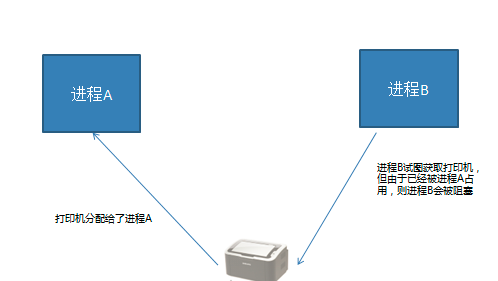


Python中提供的几种同步互斥操作方法：
- Event事件
- 锁 Lock

### 3.6.1. Event事件

multiprocessing --》 Event  

```shell
创建事件对象
e = Event()

事件阻塞
e.wait([timeout])

事件设置
e.set()
功能 ： 当e被set() 后 e.wait()不再阻塞

事件清除
e.clear()
功能 ： 当e被clear() 后 e.wait()又会阻塞

事件判断 判断当前事件对象是否被设置
e.is_set()
```

#### 3.6.1.1. 实例：通过event事件控制多进程执行的先后顺序

```python
'''
三个进程都要操作共享资源
要求必须主进程先操作
子进程中谁先操作都可以，但是有一个子进程不能长期阻塞
'''
from multiprocessing import Process,Event 
from time import sleep 

def wait_event(e):
    print("想操作临界区，但是要等主进程操作完")
    e.wait()
    print("主进程操作完了，正常执行事件1（比如读文件）", e.is_set())

def wait_event_timeout(e, sec):
    print("也想操作临界区，但是也要等主进程操作完")
    e.wait(sec)
    if e.is_set():
        print("主进程操作完了，正常执行事件2（比如读文件）", e.is_set())
    else:
        print("等不了了，不等了先执行别的", e.is_set())

if __name__ == "__main__":
    e = Event()
    p1 = Process(target = wait_event, args = (e,))
    p2 = Process(target = wait_event_timeout, args = (e, 2))

    p1.start()
    p2.start()

    print("主进程要先操作资源")
    sleep(3)
    print("主进程操作完毕，set（比如写文件）")
    e.set()  # 取消所有阻塞

    p1.join()
    p2.join()

"""
想操作临界区，但是要等主进程操作完
主进程要先操作资源
也想操作临界区，但是也要等主进程操作完
等不了了，不等了先执行别的 False
主进程操作完毕，set（比如写文件）
主进程操作完了，正常执行事件1（比如读文件） True
"""
```

### 3.6.2. 锁 Lock

multiprocessing --》 Lock

**注：** 所有子进程也必须上锁

```shell
创建对象
lock = Lock()

lock.acquire()   上锁，再次重复上锁会阻塞
lock.release()   解锁

上锁状态下： 执行acquire（）操作会阻塞
解锁状态下： 执行acquire（）不阻塞

with  lock： ---> 上锁
   ...
   ...
             ----》 with代码段结束即解锁
```

#### 3.6.2.1. 实例：上锁控制多进程的先后执行顺序

```python
from multiprocessing import Process, Lock
import sys
from time import sleep

#sys.stdout 为共享资源，所有进程都可以操作


def writer1(lock):
    lock.acquire()  # 上锁
    for i in range(3):
        sleep(1)
        sys.stdout.write("人生苦短\n")
    lock.release()  # 解锁


def writer2(lock):
    #with方式上锁
    with lock:
        for i in range(3):
            sleep(1)
            sys.stdout.write("我用Python\n")


if __name__ == "__main__":
    #创建锁
    lock = Lock()

    w1 = Process(target=writer1, args=(lock,))
    w2 = Process(target=writer2, args=(lock,))

    w1.start()
    w2.start()

    w1.join()
    w2.join()

"""
我用Python
我用Python
我用Python
人生苦短
人生苦短
人生苦短
"""
```


# 4. 线程 (threading 模块)

- **什么是线程：**

    线程也是一种多任务编程的方式，可以使用计算机多核资源。线程又被称为轻量级的进程

- **线程特征：**
  * 线程是计算机核心分配的最小单位
  * 一个进程可以包含多个线程
  * 线程也是一个运行过程，也要消耗计算机资源。多个线程共享其进程的资源和空间
  * 线程也拥有自己特有的资源属性，比如指令集，TID等
  * 线程无论创建还是删除还是运行资源消耗都小于进程
  * 多个线程之间并行执行，互不干扰

## 4.1. 创建线程

threading 模块创建线程  

```shell
threading.Thread()
功能 ： 创建线程对象
参数 ： name   线程名称，默认为 Thread-1, ...-2, ...
        target   线程函数
        args   元组   给线程函数位置传参
        kwargs  字典  给线程函数键值传参

t.start()   启动线程，自动开始运行线程函数
t.join([timeout])  回收线程
```

### 4.1.1. 实例：线程创建

```python
import threading 
from time import sleep 
import os 

a = 1

#线程函数
def music():
    global a 
    a = 10000
    for i in range(5):
        sleep(2)
        print("播放葫芦娃",os.getpid())

#创建线程对象
t = threading.Thread(target = music)

t.start()

for i in range(5):
    sleep(1.5)
    print("想听扶摇",os.getpid())

t.join()
print("a = ", a)

"""
想听扶摇 220
播放葫芦娃 220
想听扶摇 220
播放葫芦娃 220
想听扶摇 220
播放葫芦娃 220
想听扶摇 220
想听扶摇 220
播放葫芦娃 220
播放葫芦娃 220
a =  10000
"""
```
可以观察到父线程的PID和子线程的一致。

进程和线程的区别： **线程共用进程空间**

- 进程


- 线程


## 4.2. 线程属性

```shell
t.is_alive()   查看线程状态

t.name       线程名称  默认Thread-1 。。。。。
t.getName()  线程名称, 同t.name
t.setName()  设置线程名称

threading.currentThread()  获取当前线程对象

t.daemon 
    默认情况下，主线的结束不会影响分支线程
    如果设置为True 则主线程退出分支线程也会退出
设置方法：
t.daemon = True 
t.setDaemon(True)

t.isDaemon()
判断daemon属性：
    * 线程daemon属性的设置在start前
    * 一般设置daemon后不会在使用join
```

### 4.2.1. 实例：线程的setName/getName/is_alive使用

```shell
from threading import Thread,currentThread
from time import sleep 

#线程函数
def fun(sec):
    print("线程属性测试")
    sleep(sec)
    #获取线程对象 getName()获取名字
    print("%s 线程结束"%currentThread().getName())

thread = []

for i in range(3):
    t = Thread(target = fun,name = "tedu%d"%i,\
        args = (3,))
    thread.append(t)
    t.start()
    print(t.is_alive())  #查看进程状态

thread[1].setName('Tarena')  #设置线程名称
print("---->", thread[1].name, thread[2].is_alive()) #获取线程名称

#回收线程
for i in thread:
    i.join()

print("---->", thread[1].name, thread[2].is_alive()) #获取线程名称

"""
线程属性测试
True
线程属性测试
True
线程属性测试
True
----> Tarena True
tedu0 线程结束
Tarena 线程结束
tedu2 线程结束
----> Tarena False
"""
```

### 4.2.2. 实例：线程的deamon属性使用

```python
#daemon属性
from threading import Thread 
from time import sleep 

def fun():
    sleep(3)
    print("daemon 测试")

t = Thread(target = fun)

t.setDaemon(True)
print(t.isDaemon())  #查看daemon属性, 主线程退出分支线程也退出不执行了

t.start() 

print("======main thread over=====")

"""
True
======main thread over=====
"""
```

## 4.3. 创建自己的线程类

步骤：
1. 继承Thread类
2. 运行Thread类中的__init__方法以获取父类属性
3. 重写run方法


### 4.3.1. 实例：实现自己的线程类（面试题）

如何自定义实现如下功能？
```python
from threading import Thread 
from time import ctime,sleep 


#线程事件
def player(song,sec):
    for i in range(2):
        print("Playing %s : %s"%(song,ctime()))
        sleep(sec)

t = Thread(target = player,args = ('凉凉',3))

#自动执行run()
t.start()
t.join()

"""
Playing 凉凉 : Fri Jan 10 16:16:49 2020
Playing 凉凉 : Fri Jan 10 16:16:52 2020
"""
```

答案：
```python
from threading import Thread 
from time import ctime,sleep 

#创建自己的线程类
class MyThread(Thread):
    def __init__(self,target, name = "Tedu",args = (),kwargs = {}):
        super().__init__()  # init认知
        self.name = name
        self.target = target
        self.args = args
        self.kwargs = kwargs

    def run(self):
        self.target(*self.args,**self.kwargs)  # 属性认知，传参理解


#线程事件
def player(song,sec):
    for i in range(2):
        print("Playing %s : %s"%(song,ctime()))
        sleep(sec)

t = MyThread(target=player,args=('凉凉',), kwargs={'sec': 2})

#自动执行run()
t.start()
t.join()

"""
Playing 凉凉 : Fri Jan 10 16:16:49 2020
Playing 凉凉 : Fri Jan 10 16:16:52 2020
"""
```


## 4.4. 线程通信 threadpool

**通信方法：**  
多个线程共用进程空间，所以进程的全局变量对进程内的线程均可见。因此使用全局变量通信是线程主要通信方法。

**注意事项：**  
线程间通信更容易产生资源争夺，往往需要同步互斥机制保证通信安全

## 4.5. 线程的同步互斥

### 4.5.1. 线程的Event事件

操作：
```shell
e = threading.Event()
e.wait([timeout])  如果e为设置状态则不阻塞，未设置则阻塞
e.set()  将e变为设置状态
e.clear()  将e设置去除
```

#### 4.5.1.1. 实例：wait大法使用

```python
import threading 
from time import sleep 

s = None 

#创建事件对象
e = threading.Event()

def bar():
    print("呼叫foo")
    global s 
    s = "天王盖地虎"

def foo():
    print("等待口令")
    sleep(2)
    if s == "天王盖地虎":
        print("自己人")
    else:
        print("打死他")
    e.set()  # 等foo验证完毕其他的再执行

def fun():
    print("呵呵．．．．")
    sleep(1)
    # e.wait()  # wait也可以放在这里
    global s 
    s = "小鸡炖蘑菇"

t1 = threading.Thread(target = bar)
t2 = threading.Thread(target = foo)
t3 = threading.Thread(target = fun)

t1.start()
t2.start()

# 如果注释此句，那么消息s将被篡改
e.wait()  # 运行b f之后其他内容不许执行

t3.start()

t1.join()
t2.join()
t3.join()

"""
呼叫foo
等待口令
自己人
呵呵．．．．
"""
```

### 4.5.2. 线程锁

操作
```shell
lock = threading.Lock()   创建锁
lock.acquire()   上锁
lock.release()   解锁

* 也可以通过with上锁，上锁状态调用acquire会阻塞

操作原理 ： 重复上锁 acquire()会阻塞
```

#### 4.5.2.1. 实例：通过上锁控制主进程和父进程的执行顺序

```python
import threading 
from time import sleep

a = b = 0

lock = threading.Lock()

def value():
    while True:
        if a > 5:
            break
        sleep(1)
        lock.acquire() # 第2次上锁，因为重复上锁时阻塞，待释放后，立即执行
        if a == b:
            print("a == b == %d, %d"%(a,b))
        else:
            print("a = %d,b = %d"%(a,b))
        lock.release() # 解锁，让主进程的上锁立即执行
        
t = threading.Thread(target = value)
t.start()

while True:
    if a > 5:
        break
    lock.acquire()  # 第1次上锁
    a += 1
    b += 1
    print('main', a, b)
    lock.release()  # 解锁后，让第2次的上锁阻塞立即结束阻塞
    sleep(1.1)

t.join()

"""
main 1 1
a == b == 1, 1
main 2 2
a == b == 2, 2
main 3 3
a == b == 3, 3
main 4 4
a == b == 4, 4
main 5 5
a == b == 5, 5
main 6 6
a == b == 6, 6
"""
```


## 4.6. Python线程的GIL问题（全局解释器锁）

GIL（Global Intepreter Lock）

**起源：**  
Python --》支持多线程 --》由于资源共享，信息安全，产生同步互斥 --》加锁 --》超级锁（给解释器加锁）

**后果：**  
一个解释器同一时刻只能解释执行一个线程，所以导致python线程效率低下。仅在当遇到IO阻塞时线程会主动让出解释器，因此python线程更加适合高延迟的IO程序并发。

**GIL全局解释器锁：**  
Python自带的解释器是cPython。cPython在多核CPU中，只能利用一核，不能利用多核。  
在cpython解释器中，为保证数据在内存管理中的安全性，因而创造了全局解释器锁。  
cPython解释器的多线程实际上是极短时间内在多个线程进行快速切换来模拟同时计算，一个CUP同一时刻只能执行一个线程。

**其他解释器：**  
当然除了cPython解释器，还有其他的解释器，有些解释器是没有GIL锁的，见下面：  
1. Jython：用Java实现的Python解释器。不存在GIL锁。更多详情请见：https://zh.wikipedia.org/wiki/Jython
2. IronPython：用.net实现的Python解释器。不存在GIL锁。更多详情请见：https://zh.wikipedia.org/wiki/lronPython
3. pypy：用Python实现的Python解释器。存在GlL锁。更多详情请见：https://zh.wikipedia.org/wiki/PyPy

Python多线程虽然是一个假的多线程。但是在处理一些IO操作（比如文件读写和网络请求）还是可以在很大程度上提高效率的。在IO操作上建议使用多线程提高效率。在一些CPU计算操作上不建议使用多线程，而建议使用多进程。

**Python 的GIL问题 解决方案：**  
（实际无法解决，因为很多后续设计的模块都依赖于此，这是Python设计之初的历史遗留问题）  
官方解决方案：
* 尽量使用多进程。
* 不使用c作为解释器。`c#`, `java` 等其他解释器不存在（当然，可以修改c解释器底层代码，一般人算了吧）。
* 尽量使用多种方案组合的方式进行并发操作，Python线程适用于高延迟的IO操作、网络操作
* 不适合cpu密集型或者传输速度很快的IO操作

注意：线程遇到阻塞会让出解释器

**原理理解：**  
线程的效率提升在于IO密集型中的高延时阻塞。

- CPU密集型

    按道理，多任务中应该是这样的：  
      
    但线程中却是这样的：  
      

- IO密集型

    正常单进程：  
      
    阻塞的时候，会让出解释器，因此，多进程在多阻塞的情况下也能产生一定的效率提升效果，如下：  
    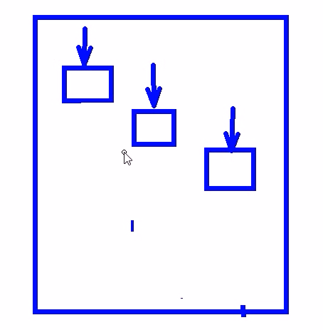  

### 4.6.1. 效率测试

```python
import multiprocessing
import threading
import time
import os


def count(x, y):
    """计算密集型"""
    c = 0
    while c < 7000000:
        c += 1
        x += 1
        y += 1


def io(i):
    """IO密集型"""
    f = open('text%s.txt'%i, 'w')
    # print('Touching file: text%s.txt'%i)
    for x in range(1000000):
        f.write("hello world\n")
    f.close()

    f = open("text%s.txt"%i)
    lines = f.readlines()
    f.close()
    
    os.remove('text%s.txt'%i)

if __name__ == "__main__":
    # 单进程cpu
    t = time.time()
    for x in range(10):
        count(1, 1)
    print("Line cpu:", time.time() - t)

    # 单进程IO
    t = time.time()
    for x in range(10):
        io(x)
    print("Line IO:", time.time() - t)


    # 多线程cpu
    t = time.time()
    counts = []
    for x in range(10):
        th = threading.Thread(target=count, args=(1, 1))
        counts.append(th)
        th.start()
    for i in counts:
        i.join()
    print("Thread cpu:", time.time() - t)

    # 多线程IO
    t = time.time()
    counts = []
    for x in range(10):
        th = threading.Thread(target=io, args=(x,))
        counts.append(th)
        th.start()
    for i in counts:
        i.join()
    print("Thread IO:", time.time() - t)


    # 多进程cpu
    t = time.time()
    counts = []
    for x in range(10):
        p = multiprocessing.Process(target=count, args=(1, 1))
        counts.append(p)
        p.start()
    for i in counts:
        i.join()
    print("Process cpu:", time.time() - t)

    # 多进程IO
    counts = []
    t = time.time()
    for x in range(10):
        p = multiprocessing.Process(target=io, args=(x,))
        counts.append(p)
        p.start()
    for i in counts:
        i.join()
    print("Process IO:", time.time() - t)

"""
Linux下执行：
$ python all_test.py
Line cpu: 9.897989273071289
Line IO: 4.457187175750732
Thread cpu: 10.954350709915161
Thread IO: 4.888957738876343
Process cpu: 6.4014739990234375
Process IO: 2.9106056690216064

Windows下执行：
Line cpu: 12.82863187789917
Line IO: 10.229126691818237
Thread cpu: 13.180431365966797
Thread IO: 8.898890733718872
Process cpu: 8.003408670425415
Process IO: 6.422340631484985
"""
```

# 5. 总结篇：进程和线程的区别和联系：

1. 两者都是多任务编程的方式，都能够使用计算机多核资源
2. 进程创建和删除要比线程消耗更多计算机资源。
3. 进程空间独立，数据安全性好，有专门的通信方法（IPC，进程通信方法），线程使用全局变量通信，更加简单，但是往往需要同步互斥操作
4. 一个进程可以创建多个线程分支，两者之间存在包含关系，可以包含多个线程，线程共享进程资源
5. 多个线程公用进程的资源，在资源操作时往往需要同步互斥
6. 进程线程都有自己的特有属性资源，如命令、id、栈区等

使用场景:

如果需要创建较多的并发，任务比较简单，线程比较适合  
如果数据操作和功能比较独立，此时使用进程比较合适  
使用线程时需要考虑到同步互斥复杂程度  
python线程要考虑到GIL问题  

总结：

进程线程的特征

1. 进程线程区别和关系？
2. 进程间通信方式都知道哪些，有什么特点？
3. 同步互斥的意义，用过什么方法，什么情况下用？
4. 给一个情景，问选择进程还是线程，为什么？
5. 一些常见概念挖掘：僵尸进程，进程状态，GIL
   僵尸进程怎么处理，线程GIL问题怎么看？


# 6. 服务器

服务器模型

## 6.1. 基本概念

硬件服务器:  
> 主机 集群

厂商 :  
> IBM HP 联想 浪潮

软件服务器：  
> 编写的服务端程序，依托于硬件服务器运行，提供给用户一定的软件服务

分类： 
> webserver --> 网站后端程序提供网站请求的 后端处理和响应  
> httpserver --》 处理HTTP请求，回复http响应  
> 邮箱服务器 --》 处理邮件  
> 文件服务器 --》 处理文件传输

功能： 
> 网络连接，逻辑处理 ，数据的交互，  
> 数据的传输，协议的实现

模型结构： 
> c/s (客户端服务器模型)  
> b/s (浏览器服务器模型)

服务器目标： 
> 处理速度快， 数据更安全，并发量大

硬件： 
> 更高的配置，集成分布基础，更好的网路速度，更多主机，更好的网路安全性

软件： 
> 程序占有更少的资源，更稳定的运行效果，更流畅的运行速度，采用更安全更合适的技术，并发性更高，更容易扩展

## 6.2. 基础的服务器模型

### 6.2.1. 循环服务器：
> 单进程程序，循环接受客户端请求，处理请求，每处理完一个请求再去接受下一个请求。  
> 优点 ：实现简单，占用资源少  
> 缺点 ：无法同时连接多个客户端，当一个客户端长期占有服务器时，形成其他客户端无法操作的情况

使用情况： 
> 任务比较短暂，udp套接字更合适

### 6.2.2. 并发服务器：

同时处理多个客户端的任务请求

#### 6.2.2.1. IO并发：
> IO多路复用协程  
> 优点：资源消耗少，效率较高，适用于IO类型服务器  
> 缺点：不能监控cpu密集型程序，本质是单进程所以不能长期阻塞消息的收发

#### 6.2.2.2. 多进程/多线程并发：
> 为每一个客户端单独提供一个进程或者线程处理请求。由于进程线程执行独立所以对其他进程不会有影响  
> 优点：客户端可以长期占有服务器，操作不会对其他进程线程产生影响  
> 缺点：消耗资源较多

#### 6.2.2.3. 多进程并发

使用fork完成并发  
> 1. 创建套接字，绑定 ，监听  
> 2. 等待接受客户端请求 accept  
> 3. 创建子进程处理客户端请求  
> 父进程继续等待其他客户端连接  
> 4. 客户端退出则子进程退出

#### 6.2.2.4. 练习1

作业 ： 
1. 客户端框架完成与服务端交互
2. 写get或者put

### 6.2.3. tftp文件服务器

功能要求：  
> * 客户端有简单的命令提示界面  
> * 根据提示选择相应的功能  
>   1. 查看服务器文件库的文件列表（只显示普通文件）  
>   2. 下载其中的某个文件到本地  
>   3. 可以将本地文件上传到文件库中  
>   4. 退出  
> * 服务器需求： 
>   1. 处理客户端各种请求  
>   2. 允许多个客户端同时访问操作

```
1. 技术分析 
   用什么套接字   tcp
   需要什么服务器模型   多进程并发
   需要注意的问题  粘包  僵尸进程 
   数据如何传输   文件名传输 注意粘包处理
                   文件传输注意传输结尾

2. 设计整体结构
   要求封装为类，将功能函数写类中
      class TFTPServer（）：
         def __init__():
	    交互套接字
	 def do_list()
	 def do_get()
	 def do_put()
	
   main（）函数控制整体流程
     创建套接字
     接受客户端连接
     创建子进程
     父进程继续等待连接
```


### 6.2.4. threading 的多线程并发
> 每有一个客户端就创建一个新的线程处理客户端请求

对比多进程  
> 优点：资源消耗少  
> 缺点：需要处理共享资源  
> 注意GIL问题

实现步骤  
> 1. 创建套接字，绑定，监听  
> 2. 接收客户端请求，创建新的线程  
> 3. 主线程继续等待其他客户端连接，分支线程执行客户端请求  
> 4. 处理完客户端请求后，分支线程退出，关闭客户端套接字

### 6.2.5. socket 服务器的继承模块

```shell
python2  SocketServer
python3  socketserver

功能 ： 通过模块的接口完成基于多进程/多线程的             tcp/udp的socket并发程序

'StreamRequestHandler',    处理tcp请求
'DatagramRequestHandler',  处理udp请求

'ForkingMixIn',       建立多进程
'ForkingTCPServer',   建立多进程tcp server
'ForkingUDPServer',   建立多进程udp server

'ThreadingMixIn',     建立多线程
'ThreadingTCPServer',  建立多线程tcp server
'ThreadingUDPServer',  建立多线程udp server

'TCPServer',    建立tcp server
'UDPServer',    建立udp server
```

### 6.2.6. 基于多线程并发的HTTPServer
> 1. 接收浏览器的http请求  
> 2. 对请求进行解析  
> 3. 根据解析判断请求内容  
> 4. 将要返回的内容组织http响应格式发送给客户端

升级： 
> * 使用多线程并发  
> * 增加具体请求解析  
> * 增加数据获取功能  
> * 封装使用类

技术实现： 
> threading 并发  
> tcp socket 传输  
> HTTP协议响应和请求的格式

## 6.3. 练习2

作业 ：
1. 总结进程线程和网络中的概念问答题
2. 聊天室，tftp文件服，httpserver第二版
3. 复习规划


# 7. 附


解释器和编译器的区别：

**解释器**是一条一条的解释执行源语言。比如php，postscritp，javascript就是典型的解释性语言。

**编译器**是把源代码整个编译成目标代码，执行时不在需要编译器，直接在支持目标代码的平台上运行，这样执行效率比解释执行快很多。比如C语言代码被编译成二进制代码（exe程序），在windows平台上执行。

他们最大的**区别**是程序运行时需要解释器边解释边执行，而编译器则在运行时是完全不需要的

**解释器**的**优点**是**比较容易让用户实现自己跨平台的代码**，比如java，php等，同一套代码可以在几乎所有的操作系统上执行，而无需根据操作系统做修改；

**编译器**的目的就是生成目标代码再由连接器生成可执行的机器码，这样的话需要根据不同的操作系统编制代码，虽然有像Qt这样的源代码级跨平台的编程工具库，但在不同的平台上仍然需要重新编译连接成可执行文件，**但其执行效率要远远高于解释运行的程序。**

**——来源：解释器和编译器区别和联系 - CSDN博客**

<https://blog.csdn.net/s646575997/article/details/52577256>

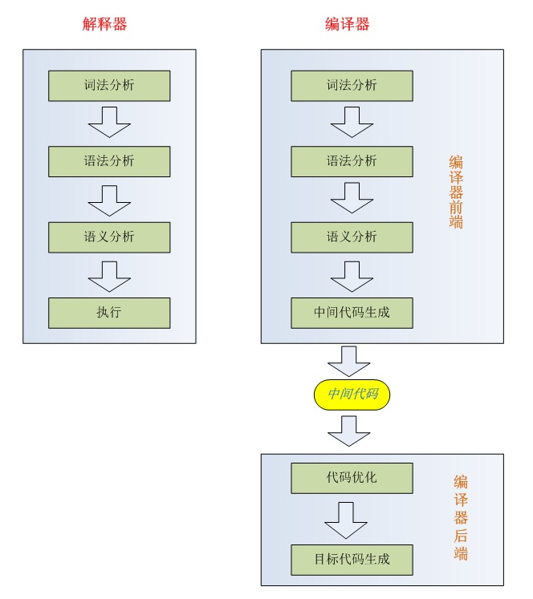
