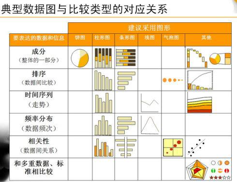
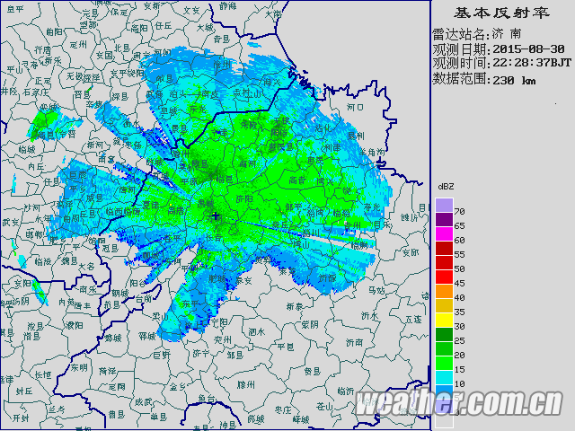
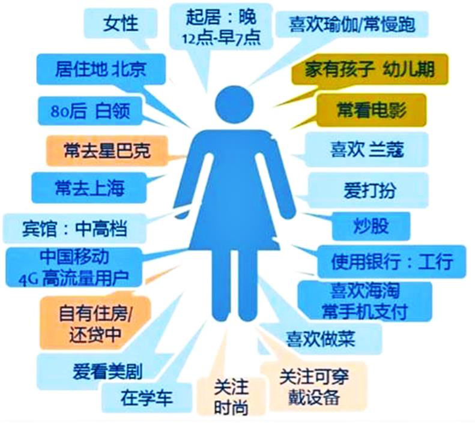
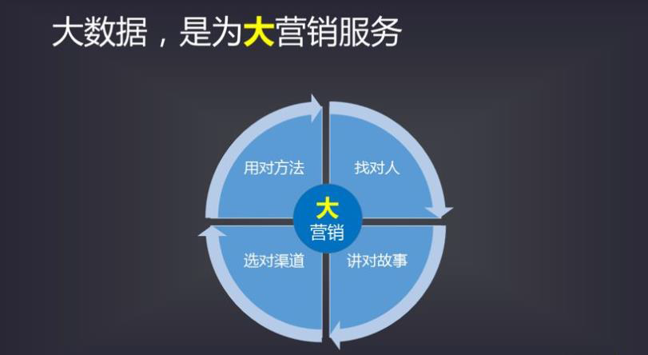
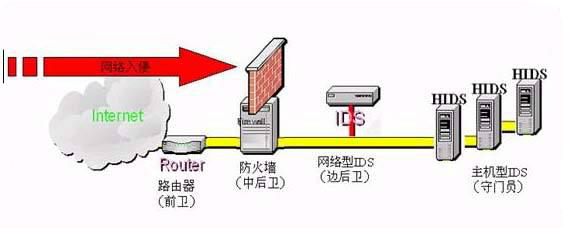
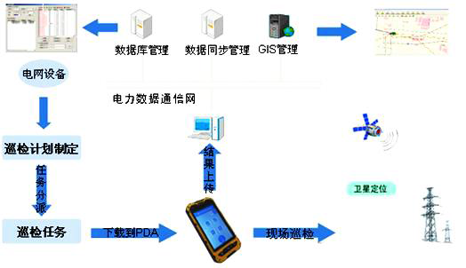
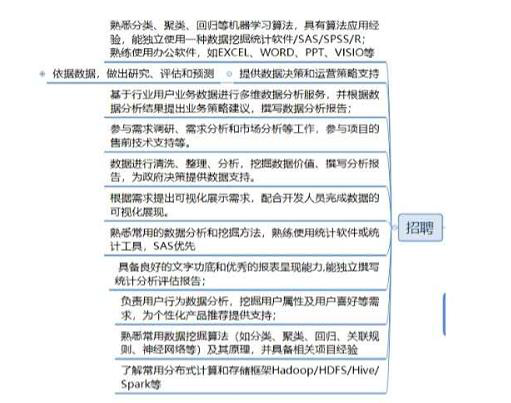
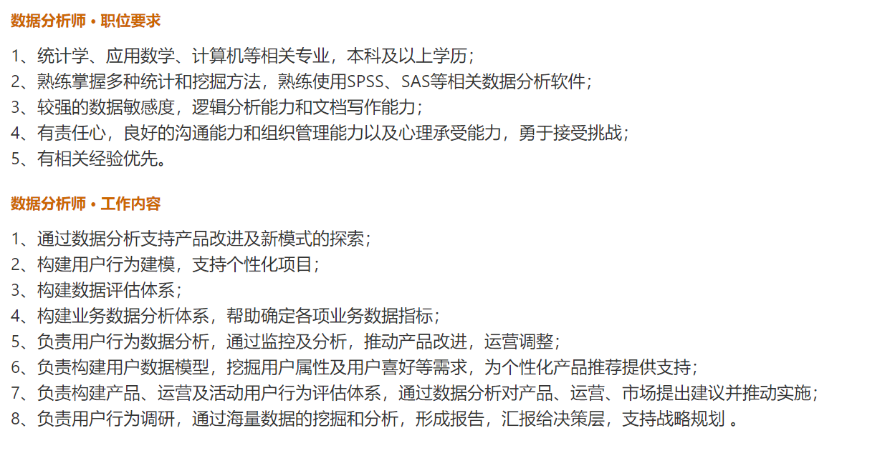
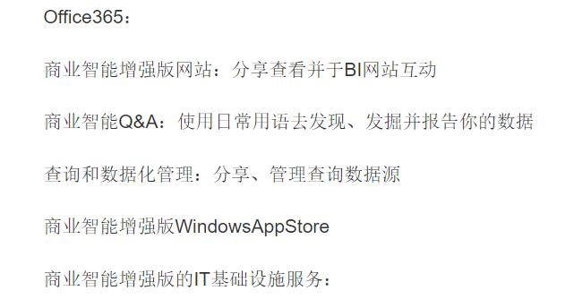

<!-- main -->
<h1>Chapter03 Pandas与数据分析</h1>

# 2. 数据分析认知
## 2.1. 数据分析概述

**什么是数据分析？**

> 之前在微博上发起一个话题，大家一句话向外行说说什么是数据分析?有100 多位同学参与讨论和转发，其中一些有意思的、不错的说法，大家一起来看看。
>
> 最专业的数据分析：  
> @沈浩老师: 有针对性的收集、加工、整理数据，并采用统计和挖掘技术分析和解释数据的科学与艺术!  
>
> 最简洁的数据分析：  
> @ 小蚊子乐园：简单的很，就是分析数据。  
> @Terensu：描述数据特征，预测数据趋势，展示分析结果。  
> @wangman02：从一大堆数据中提取到你想要的信息，就是数据分析。  
>
> 最浪漫的数据分析：  
> @数据化管理：数据分析就是：茫茫人海中，你通过观察、跟踪、记录等手段找到你生命中最想爱的那个人，进而根据对方的喜好，成功的展示了自己的优点，改进了自己的缺点，并且说服了对方的父母，承诺终身与ta 为伴的一项工作。  
> @刘万祥ExcelPro: 你喜欢上一个姑娘，你会搜集她的兴趣、爱好、星座、闺密、乃至三围。。。等等各种信息吧，然后想自己怎么能搭讪上、约出来，碰壁了会继续找原因、想办法，这里面你都有在做数据分析呀。

### 2.1.1. 数据分析的概念

**数据分析：**
> 数据分析是指用适当的统计分析方法，对收集来的大量数据进行分析，隐藏在数据背后的信息提炼出来，提取有用信息和形成结论，而对数据加以详细研究和概括总结的过程

**数据分析包括如下几个主要作用：**
  1. 现状分析：分析已经发生了什么。eg：《综合资源系统系统需求实施进展分析》
  2. 原因分析：分析为什么发生某一现状。eg：《业务开通系统管控问题分析》
  3. 预测分析：分析将来可能发生什么。eg：《网管需求管控项目风险识别清单》

**数据分析的分类：**
- 描述性数据分析
- 探索性数据分析
- 验证性数据分析

> 描述性数据分析属于初级分析方法，是我们工作中最常用的数据分析方法；
>   
> 探索性数据分析侧重于在数据中探索新的特征，验证性数据分析侧重于验证之前假设的真伪性；  
> 
> 探索性数据分析以及验证性数据分析属于高级分析方法，常见的分析方法有相关分析、因子分析、回归分析等。

### 2.1.2. 数据分析的步骤
数据分析的过程主要包括6个既相对独立又相互联系的阶段，下面分别进行介绍。
> 1. 确定分析目的与思路
> 2. 收集数据
> 3. 数据处理
> 4. 数据分析与建模
> 5. 模型评价与优化
> 6. 部署
> 7. 数据展现
> 8. 撰写报告

描述：
> 1. 需求分析  
> 业务部门 / 财务部门 / 生产部门
> 2. 数据获取  
> 网络爬虫 / 历史数据 / 实时数据
> 3. 数据预处理  
> 数据合并 / 数据清洗 / 数据标准化 / 数据变换
> 4. 分析与建模  
> 对比分析 / 分组分析 / 交叉分析 / 回归分析 / 智能推荐 / 关联规则 / 分类模型 / 聚类模型
> 5. 模型评价与优化  
> 聚类模型评价 / 分类模型评价 / 回归模型评价
> 6. 部署  
> 业务系统 / 财务系统 / 生产系统

数据分析的过程主要包括6个既相对独立又相互联系的阶段，下面分别进行介绍。
1. 确定分析目的与思路  
梳理分析思路，并搭建分析框架，把分析目的分解成若干个不同的分析要点，即如何具体开展数据分析，需要从哪几个角度进行分析，采用哪些分析指标。  
一个分析项目，你的数据对象是谁?商业目的是什么?要解决什么业务问题?数据分析师对这些都要了然于心。  
基于商业的理解，整理分析框架和分析思路。例如，减少新客户的流失、优化活动效果、提高客户响应率等等。不同的项目对数据的要求，使用的分析手段也是不一样的。
2. 收集数据  
公司数据：业务数据，客户资源，在职员工信息等，分析公司过往的发展情况，从而更好地把握未来  
公开数据源：公开发行的刊物，eg：中国统计年鉴。世界发展报告  
网络：国家相关部门统计信息，各种信息查询平台，以及专业的四三份机构，及各种网站  
市场调查：运用科学的方法，有目的的系统搜集，记录和整理有关市场营销的信息和资料，分析市场情况，了解市场现状以及发展趋势，为市场预测和营销策略提供客观和正确的资料  
网络爬虫/第三方统计工具  
3. 数据处理  
数据处理是从大量的、可能是杂乱无章的、难以理解的数据中抽取并推导出对于某些特定的人们来说是有价值、有意义的数据，并将其形成适合数据分析的样式。  
具体是指对数据进行数据合并，数据清洗，数据变换和数据标准化，数据变换后使得整体数据变为干净整齐，可以直接用于分析建模这一过程的总称  
常用工具：Excel 数据清洗数据转化数据计算  
编程解决：Python R语言  
Tips：在做数据处理时，不要在原始数据上进行数据处理以防原始数据丢失，保留数据处理过程以便发现错误时查找。  
4. 数据分析与建模  
分析与建模是指通过对比分析、分组分析、交叉分析、回归分析等分析方法和聚类、分类、关联规则、智能推荐等模型与算法发现数据中的有价值信息，并得出结论的过程  
数据分析：用适当的分析方法及工具，简单的可通过Excel完成，复杂的可通过编程/专业的数据分析软件来完成，对处理过的数据进行分析，提取有价值的信息，形成有效的结论。  
数据挖掘：侧重解决四类数据分析问题：分类、聚类、关联和预测，重点在寻找模式与规律。  
对于初学者，需要先掌握数据分析，再进一步学习数据挖掘  
5. 模型优化与评价  
模型评价是指对已经建立的一个或多个模型，根据其模型的类别，使用不同的指标评价其性能优劣的过程。  
6. 部署  
部署是指将通过了正式应用数据分析结果与结论应用至实际生产系统的过程    
7. 数据展现  
能用图说明问题的就不用表格，能用表说明问题的就不用文字。  
折线图：按照时间序列分析数据的变化趋势时使用。  
柱状图：指定一个分析轴进行数据大小的比较时使用。  
饼图：指定一个分析轴进行所占比例的比较时使用。  
散点图：描述两个变量相关关系时使用。  

8. 编写报告  
(最重要的是给谁看)  
   1. 要有一个好的框架
   2. 一定要有解决方案和建议方案
   3. 每个分析都有结论，而且结论一定要明确
   4. 尽量图表化
   5. 不要试图面面俱到，要有重点
   6. 不要记叙文，要议论文
   7. 不要回避"不良结论"
   8. 不要有猜测性的结论

简单数据描述：
- 集中趋势： 平均数、加权算术平均数、中位数、众数
- 离散趋势： 方差、标准差、全距
- 相对位置： 百分比、四分位
- 变化趋势： 同比、环比

课程目标：编程掌握：  
1、数据读取  
2、数据清洗  
3、数据整理  
4、数据分析  
5、数据可视化  
6、数据探索  

培养数据洞察力  
1、Python  
2、Ipython  
3、Numpy  
4、Scipy  
5、Pandas  
6、Matplotlib/seaborn  
7、Statsmodels

## 2.2. 数据分析行业
### 2.2.1. 数据分析应用领域
1. 教育学  
成绩预测 / 分类排名
2. 医学  
诊断病例 / 药物研究
3. 气象学  
天气预报 / 灾情预防
4. 环境科学  
环境监测 / 污染治理
5. 考古地质  
矿产预测 / 考古断代
6. 生物学  
基因鉴定 / 种群分类
7. 服装工业  
服装设计 / 型号确定
8. 经济学  
信用评价 / 经济决策
9. 农业  
灌区分类 / 品种筛选
10. 社会科学  
青少年 / 犯罪研究
11. 文学  
虚词频数 / 鉴定作品
12. 其他  
交通体育 / 军事 / 心理学

- 气象学--天气预报雷达图http://products.weather.com.cn/product/radar/index/procode/JC_RADAR_AZ9531_JB

- 网上购物，网站评价

### 2.2.2. 数据分析应用场景
**客户分析**
- 主要是客户的基本数据信息进行商业行为分析，首先界定目标客户，根据客户的需求，目标客户的性质，所处行业的特征以及客户的经济状况等基本信息使用统计分析方法和预测验证法，分析目标客户，提高销售效率。
- 其次了解客户的采购过程，根据客户采购类型、采购性质进行分类分析制定不同的营销策略。
- 最后还可以根据已有的客户特征，进行客户特征分析、客户忠诚分析、客户注意力分析、客户营销分析和客户收益分析。

**营销分析**  
囊括了产品分析，价格分析，渠道分析，广告与促销分析这四类分析。
- 产品分析主要是竞争产品分析，通过对竞争产品的分析制定自身产品策略。
- 价格分析又可以分为成本分析和售价分析，成本分析的目的是降低不必要成本，售价分析的目的是制定符合市场的价格。
- 渠道分析目的是指对产品的销售渠道进行分析，确定最优的渠道配比。
- 广告与促销分析则能够结合客户分析，实现销量的提升，利润的增加。

**社交媒体分析**  
以不同社交媒体渠道生成的内容为基础，实现不同社交媒体的用户分析，访问分析，互动分析等。同时，还能为情感和舆情监督提供丰富的资料。
- 用户分析主要根据用户注册信息，登录平台的时间点和平时发表的内容等用户数据，分析用户个人画像和行为特征。
- 访问分析则是通过用户平时访问的内容，分析用户的兴趣爱好，进而分析潜在的商业价值。
- 互动分析根据互相关注对象的行为预测该对象未来的某些行为特征。

**网络安全分析**  
新型的病毒防御系统可使用数据分析技术，建立潜在攻击识别分析模型，监测大量网络活动数据和相应的访问行为，识别可能进行入侵的可疑模式，做到未雨绸缪。

**设备管理**  
通过物联网技术能够收集和分析设备上的数据流，包括连续用电、零部件温度、环境湿度和污染物颗粒等无数潜在特征，建立设备管理模型，从而预测设备故障，合理安排预防性的维护，以确保设备正常作业，降低因设备故障带来的安全风险

**交通物流**
物流是物品从供应地向接收地的实体流动。通过业务系统和GPS定位系统获得数据，对于客户使用数据构建交通状况预测分析模型，有效预测实时路况、物流状况、车流量、客流量和货物吞吐量，进而提前补货，制定库存管理策略。

数据分析人才需要具备的能力：
1. 懂分析：既然是数据分析人才，就应该掌握数据分析的基本原理与一些有效的数据分析方法，并能灵活运用到实践工作中去，这个是每个数据分析人才需要具备的能力
2. 懂工具：数据分析方法都是一些理论的方法，要将理论付诸于实践，就必须借助于数据分析工具或者拥有数据分析编程技术，进行全面和深层次的分析和挖掘，从而获取更多具有商业价值的信息。
3. 懂业务：一个好的数据分析师，必须熟悉所在行业的行业知识，业务及流程，最好有自己独到的见解，
4. 懂设计：对与数据分析师来讲，分析出来的结果要让别人看的清楚，就需要经过一些设计，是分析结果一目了然，还能在一定程度尚体现数据分析师的水准

### 2.2.3. 数据分析行业对人才的培养
数据分析人才必备的素质：
1. 态度必须严谨，责任心强
2. 思维必须敏捷，具有一定的数据思维
3. 对数据较敏感
4. 逻辑思维高度清晰
5. 具有刨根问底的精神
6. 沟通能力强，工作细心，有耐心

### 2.2.4. 数据分析职位体系

### 2.2.5. 数据分析师的职位要求

## 2.3. 其他数据分析工具介绍

1. 从Excel到PowerBI商业智能数据分析  
Power BI (Power Business Intelligence），商业智能增强版，是微软为Office组件提供的一套商业智能工具。通过这些功能，让你可以达成自助分析你的所有数据。  
Power BI Desktop/Mobile  
Power BI 包括了如下的一些组件和服务：  
  
  
- 报表共享与协作
- 自动快速洞察数据
- 实时分析仪表板
- 自定义可视化图表
- 计划刷新与实时刷新

2. Tableau介绍  
   - Tableau Software致力于帮助人们查看并理解数据。Tableau 帮助任何人快速分析、可视化并分享信息。超过42,000 家客户通过使用Tableau 在办公室或随时随地快速获得结果。数以万计的用户使用Tableau Public 在博客与网站中分享数据。

3. SAS介绍  
   - SAS（全称STATISTICAL ANALYSIS SYSTEM，简称SAS）是全球最大的软件公司之一，是由美国NORTH CAROLINA州立大学1966年开发的统计分析软件。  
   - 1976年SAS软件研究所（SAS INSTITUTE INC）成立，开始进行SAS系统的维护、开发、销售和培训工作。期间经历了许多版本，并经过多年来的完善和发展，SAS系统在国际上已被誉为统计分析的标准软件，在各个领域得到广泛应用。

4. SPSS介绍  
   - SPSS（Statistical Product and Service Solutions），"统计产品与服务解决方案"软件。最初软件全称为"社会科学统计软件包"（SolutionsStatistical Package for the Social Sciences），但是随着SPSS产品服务领域的扩大和服务深度的增加，SPSS公司已于2000年正式将英文全称更改为"统计产品与服务解决方案"，这标志着SPSS的战略方向正在做出重大调整。SPSS为IBM公司推出的一系列用于统计学分析运算、数据挖掘、预测分析和决策支持任务的软件产品及相关服务的总称，有Windows和Mac OS X等版本。

